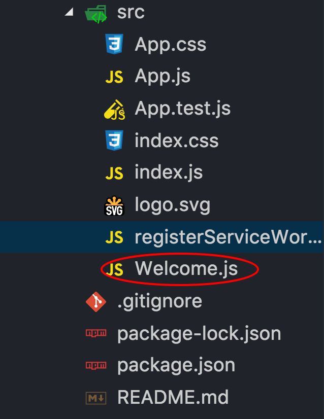

### 创建我的第一个React组件
本片文章主要是教大家怎么创建一个React组件，通过这篇文章你可以学会怎么创建React组件以及怎么使用React组件。
#### 1、创建组件文件Welcome
在src目录中创建Welcome.js文件

#### 2、编写Welcome组件
```js
import React from 'react';
class Welcome extends React.component{
    render(){
        return <h1>Welcome React!</h1>
    }
}
export default Welcome;
```
#### 3、在index.js中引用Welcome组件
* 1)引入Welcome组件
```js
import Welcome from './Welcome';
```
* 2)使用Welcome组件
```js
ReactDOM.render(<Welcome />, document.getElementById('root'));
```